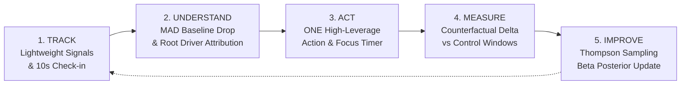

# MaxxLoop

> **The Closed-Loop AI Companion for Student Focus & Recovery**  
> *Track: Wellness & Lifestyle — ASYNC 2026 Hackathon*

---

## 🏆 One-Paragraph Pitch

College students and knowledge workers don't need another passive wellness dashboard charting their burnout after it happens. **MaxxLoop** is an intelligent, closed-loop AI companion that **detects** when focus or energy drops below a personal baseline using robust statistical models, **explains** the exact root causes in plain language, recommends **exactly ONE** high-leverage micro-action, **measures** true counterfactual net recovery in the subsequent window, and **learns** what works for that specific individual over time.

---

## 🔄 The 5-Stage Closed Loop

The core loop is the entire product. If a feature does not serve this loop, it was cut:



1. **Track**: Continuous lightweight telemetry (sleep, calendar density, browser tab switching) combined with a 10-second state check-in.
2. **Understand**: Mathematical MAD baseline comparison flags acute drops and isolates the top 2-3 negative drivers with calm, plain-language attribution.
3. **Act**: Recommends exactly **ONE** micro-action from a curated 24-item library—preventing decision paralysis.
4. **Measure**: Re-evaluates after a 25-minute window and subtracts estimated control drift to compute honest net treatment effect.
5. **Improve**: Updates a Bayesian Beta posterior ($Beta(\alpha, \beta)$) for each user × action, continuously sharpening personal recommendations.

---

## 📱 Mobile-First Visual Experience (390px Design Target)

MaxxLoop is crafted with a calm, premium, focused visual aesthetic:
- **Signature 5-Stage Loop Ring**: An interactive SVG indicator animating the user's progress through the five stages of recovery.
- **Circular Capacity Gauge**: 0–100 real-time score centered on a personal 50-point baseline, paired with a 14-day trajectory sparkline.
- **Plain-Language Driver Chips**: Translates negative z-contributions into non-judgmental human context (*"Tab switching 3x higher than usual pace"*, *"Slept 1.5h less than baseline"*).
- **"Why This?" Math Drawer**: Full transparency revealing clipped z-scores, weights, and Thompson Sampling priors.
- **Before / After Recovery Chart**: Displays observed change, estimated counterfactual drift, and net effect with confidence labels (Low / Medium / High).

---

## ⚡ 3-Command Quick Start

For detailed execution and demo instructions, see [README_EXECUTION.md](README_EXECUTION.md).

```bash
# 1. Setup backend and frontend dependencies
make setup

# 2. Launch API (:8000) and Web (:3000)
make dev

# 3. Open Demo Console in your browser
# Navigate to: http://localhost:3000/demo
```

---

## 🌟 Key Features Mapped to the 5 Loop Stages

| Stage | Feature | Implementation Details |
|---|---|---|
| **1. Track** | **10-Second State Check-in** | Low-friction sliders for Focus, Energy, and Stress with optional notes. Scans for crisis keywords in real-time. |
| **1. Track** | **Privacy-Preserving Sensors** | Ingests calendar duration and browser tab blur rates. Raw titles, meeting attendees, and URLs are never captured. |
| **2. Understand** | **Rolling MAD Baseline** | Computes 14-day rolling median and Median Absolute Deviation (MAD), bucketed by time of day. |
| **2. Understand** | **Driver Attribution** | Decomposes weighted z-score contributions to isolate the top 2-3 root causes. |
| **2. Understand** | **Zero-Key Template Fallback** | Instant, deterministic plain-language explanations with zero API key dependencies. Pluggable Gemini/Ollama/OpenAI upgrades. |
| **3. Act** | **ONE Action Rule** | Never shows overwhelming lists. Recommends exactly one action selected via Thompson Sampling. |
| **3. Act** | **Curated 24-Action Library** | Low-risk behavioral resets across breathing, movement, hydration, daylight exposure, noise, posture, and planning. |
| **3. Act** | **Focus Countdown Timer** | Visual circular timer with step-by-step checklists and early completion toggles. |
| **4. Measure** | **Counterfactual Net Effect** | Compares post-action score against historical control windows (skipped drops) to establish true net treatment effect. |
| **4. Measure** | **Confidence Indicator** | Labels confidence as Low, Medium, or High based on sample size and variance. |
| **5. Improve** | **Thompson Sampling Learning** | Updates Beta conjugate posteriors ($\alpha \leftarrow \alpha + 1$ on success) with a 15% exploration window. |
| **5. Improve** | **Personal Insights Leaderboard** | Ranks "What Works For You" with 95% Credible Intervals, drop time-of-day distributions, and loop streak tracking. |

---

## 🛡️ Safety & Ethical AI Guardrails

1. **Non-Medical Boundary**: Clear disclaimers throughout: wellness support, not medical advice. No diagnoses, prescriptions, diet, or supplement recommendations.
2. **Crisis Interception**: Real-time scanner intercepts self-harm or hopelessness phrases in English, Hindi, and Kannada. Immediately halts algorithmic flow and displays supportive crisis resources linking India's **Tele-MANAS** (`14416` / `1800-891-4416`). Sensitive text is discarded in memory and never stored in SQLite.
3. **Driver-Consistency Post-Filter**: Rejects any generated LLM output that hallucinates causes absent from calculated input drivers.
4. **Persistent Low Warning**: Flags users experiencing below-threshold capacity for 5+ days, gently suggesting human connection.

---

## 🔒 Zero-Knowledge Privacy Architecture

- **Local-First SQLite Storage**: All user signals, snapshots, interventions, and posteriors live strictly on the user's device (`maxxloop.db`).
- **Live Payload Transparency Inspector** (`/privacy`): Users can view the exact 4-variable sanitized payload sent to an LLM.
- **Portability & Erasure**: Full one-click JSON export and permanent hard deletion of all local telemetry.

---

## 📊 Validated Synthetic Simulation

We conducted a 200-user synthetic simulation across 30 recovery rounds (6,000 closed loops) with hidden true efficacy parameters (`scripts/simulate_users.py`). Results documented in [docs/EVALUATION.md](docs/EVALUATION.md):
- **Convergence**: Allocation for top-performing actions (*Corridor Stride* and *Physiological Sigh*) grew from 14% to **58.8%** of mature recommendations.
- **User Helpfulness**: Converged to **88.4%** helpfulness rating.
- **Net Recovery**: Average next-window capacity improvement reached **+7.4 points**.

---

## 💻 Tech Stack (Fixed & Minimal)

- **Frontend**: Next.js 14 (App Router), TypeScript, Tailwind CSS, Recharts, Lucide Icons, Mobile-First PWA (390px viewport target).
- **Backend**: Python 3.11+, FastAPI, SQLModel / SQLAlchemy, Pydantic v2, SQLite (local-first).
- **ML / Math Engine**: NumPy, SciPy, Pandas. Deterministic, fully explainable, unit-tested.
- **LLM Layer**: Pluggable provider interface (`TemplateProvider`, `GeminiProvider`, `OllamaProvider`, `OpenAICompatProvider`).
- **Tooling**: pytest, Docker, docker-compose, Makefile.

---

## 📁 Repository Structure

```text
maxxloop/
├── apps/
│   ├── api/
│   │   ├── app/
│   │   │   ├── main.py              # FastAPI application entrypoint
│   │   │   ├── core/                # config, db, safety guardrails (14416)
│   │   │   ├── models/              # SQLModel tables & Pydantic schemas
│   │   │   ├── engine/              # baseline, capacity, drop_detect, drivers, recommender, measure
│   │   │   ├── llm/                 # template fallback, gemini, ollama, validator
│   │   │   ├── data/                # actions.json (24 actions), weights.yaml, population_priors.yaml
│   │   │   └── routers/             # signals, checkins, capacity, loop, insights, privacy, demo
│   │   ├── tests/                   # engine, recommender, measurement, safety, e2e unit tests
│   │   ├── requirements.txt
│   │   └── Dockerfile
│   └── web/                         # Next.js 14 Mobile-First PWA (390px design target)
│       ├── src/app/                 # Now (/), insights, privacy, demo, onboarding
│       ├── src/components/          # LoopRing, CapacityGauge, Sparkline, DriverChip, ActionTimer, etc.
│       ├── src/lib/                 # api.ts client
│       └── public/                  # manifest.json
├── scripts/
│   ├── seed_demo.py                 # CLI seeder for Aarav & Meera personas
│   └── simulate_users.py            # 200-agent synthetic evaluation script
├── docs/
│   ├── ARCHITECTURE.md              # Full system & math formulations
│   ├── API.md                       # Complete REST API documentation
│   ├── DEMO_SCRIPT.md               # 90-second and 3-minute judging scripts
│   ├── VIDEO_STORYBOARD.md          # 2-minute prototype video storyboard
│   ├── PROJECT_STATUS.md            # Honest completion & verification matrix
│   ├── PITCH_UPDATE.md              # Slide-by-slide presentation update
│   ├── PRIVACY_AND_SAFETY.md        # Privacy guarantees and Tele-MANAS protocol
│   ├── EVALUATION.md                # 200-user simulation findings
│   └── ASSUMPTIONS.md               # Engineering & design decisions
├── docker-compose.yml
├── Makefile
├── .env.example
├── README.md                        # Master Project Overview (This file)
└── README_EXECUTION.md              # Step-by-Step Run & Demo Guide
```

---

## ⚠️ Honest Limitations

1. **Synthetic Simulation**: While the recommender mathematically converges in simulation, real human cognitive recovery is influenced by unpredictable external stressors.
2. **Control Window Estimation**: Expected drift without action is estimated using past skipped drops. Users with few skipped drops rely temporarily on documented prior drift (+1.5 pts).
3. **Calendar OAuth**: Currently ingests meeting durations and counts via API schemas; native direct Google OAuth is slated for Phase 2.

---

## 👥 Team MaxxLoop

Built with precision for **ASYNC 2026** (Wellness & Lifestyle Track).
- **Core Thesis**: *Track → Understand → Act → Measure → Improve.*
- **Version**: `v1.0.0-demo`
