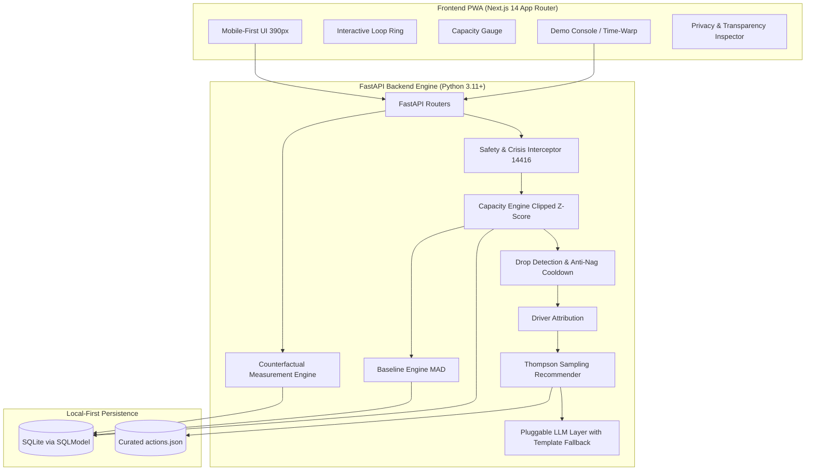
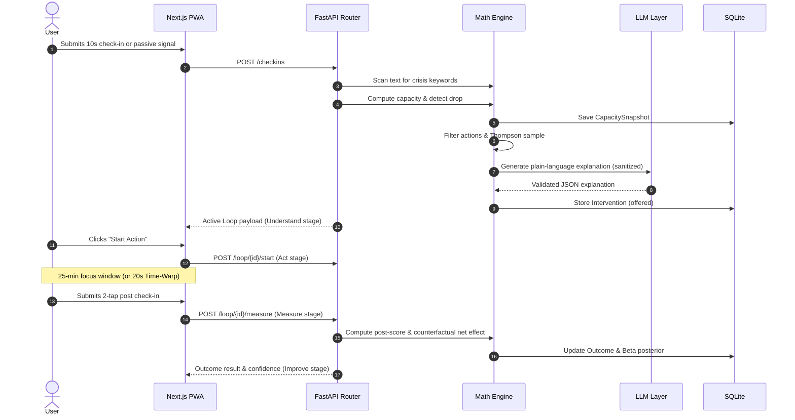

# MaxxLoop Architecture & Engineering Specifications

MaxxLoop is designed as a closed-loop AI wellness companion for students and knowledge workers, built specifically for the **ASYNC 2026 Hackathon (Wellness & Lifestyle Track)**.

---

## 1. System Overview & Component Diagram

---

## 2. Core Mathematical Engine Formulations

MaxxLoop does not rely on opaque heuristics or hardcoded screens. Every metric displayed is computed through deterministic statistical formulations.

### 2.1 Personal Baseline (Rolling Median & MAD)
For each input signal $x$, the baseline is computed over a rolling 14-day window:
$$\text{Median} = \text{median}(\{x_i\}_{i=1}^N)$$
$$\text{MAD} = \text{median}(|x_i - \text{Median}|)$$
$$\text{Robust Spread} = 1.4826 \times \max(\text{MAD}, 0.01)$$

When $N \ge 5$ within a time-of-day bucket (morning, afternoon, evening, night), bucketed parameters are used. For cold starts ($N < 5$), population priors from `data/population_priors.yaml` are blended.

### 2.2 Capacity Score ($0 - 100$)
Signals are standardized into clipped z-scores $z_i \in [-3.0, 3.0]$:
$$z_i = \text{clip}\left(\frac{x_i - \text{Median}_i}{\text{Robust Spread}_i}, -3.0, 3.0\right)$$
For inverse signals (stress, context switches, meeting burden), the sign is inverted ($z_i \leftarrow -z_i$).

The total weighted z-score is computed using weights $w_i$ (where $\sum w_i = 1.0$):
$$Z_{\text{total}} = \sum_{i=1}^K w_i z_i$$
The final Capacity Score is mapped linearly to $[0, 100]$ with 50 representing the user's normal baseline:
$$\text{Capacity} = \text{clip}\left(50.0 + \frac{Z_{\text{total}}}{3.0} \times 50.0, 0.0, 100.0\right)$$

### 2.3 Drop Detection & Anti-Nag Cooldown
A capacity drop is flagged if and only if:
$$\Delta = \text{Capacity} - 50.0 \le -\max(10.0, 1.0 \times \text{Robust Spread})$$
$$\text{OR} \quad \text{Capacity}_{t} - \text{Capacity}_{t-1} \le -15.0$$

**Anti-Nag Cooldown Rules**:
- Minimum 45 minutes between interventions.
- Maximum 3 interventions per 24-hour period.

### 2.4 Thompson Sampling Recommender
Candidate actions are filtered to match active driver categories. Each (user, action) pair maintains a conjugate Beta posterior:
$$\theta_a \sim \text{Beta}(\alpha_a, \beta_a)$$
- Initialized from `prior_effect` ($n_0 = 4$).
- With probability $1 - \epsilon$ ($\epsilon = 0.15$), the engine selects $a^* = \arg\max \theta_a$.
- With probability $\epsilon = 0.15$, an exploratory candidate is selected to ensure non-stagnant personalization.

### 2.5 Counterfactual Measurement
After the action window (default 25 min; 20s in Demo mode), re-measurement evaluates:
$$\text{Observed Delta} = \text{Score}_{\text{post}} - \text{Score}_{\text{pre}}$$
$$\text{Expected Delta (No Action)} = \frac{1}{M}\sum_{j=1}^M \Delta_{\text{control}, j}$$
$$\text{Net Treatment Effect} = \text{Observed Delta} - \text{Expected Delta (No Action)}$$

If Net Effect $> 2.0$, $\alpha_a \leftarrow \alpha_a + 1.0$; otherwise $\beta_a \leftarrow \beta_a + 1.0$.

---

## 3. Data Flow of a Single Closed Loop

---

## 4. Design Decisions & Trade-Offs

| Decision | Alternative Considered | Why Chosen |
|---|---|---|
| **Local-First SQLite** | Cloud PostgreSQL / Supabase | Absolute user privacy for student health data; zero setup friction for hackathon judges. |
| **TemplateProvider Default** | Require Gemini / OpenAI key | Guarantees the demo never fails, zero API key requirement, instantaneous responses. |
| **Thompson Sampling** | Simple heuristic or LLM picker | Statistically proven bounded regret; learns individual physiological responsiveness over time. |
| **Mobile-First PWA (390px)** | Desktop dashboard | Wellness companions are used in transient micro-moments on phones, not sprawling monitors. |
| **Counterfactual Net Effect** | Raw before/after delta | Honest measurement: natural fatigue drift is accounted for using skipped drops as controls. |
