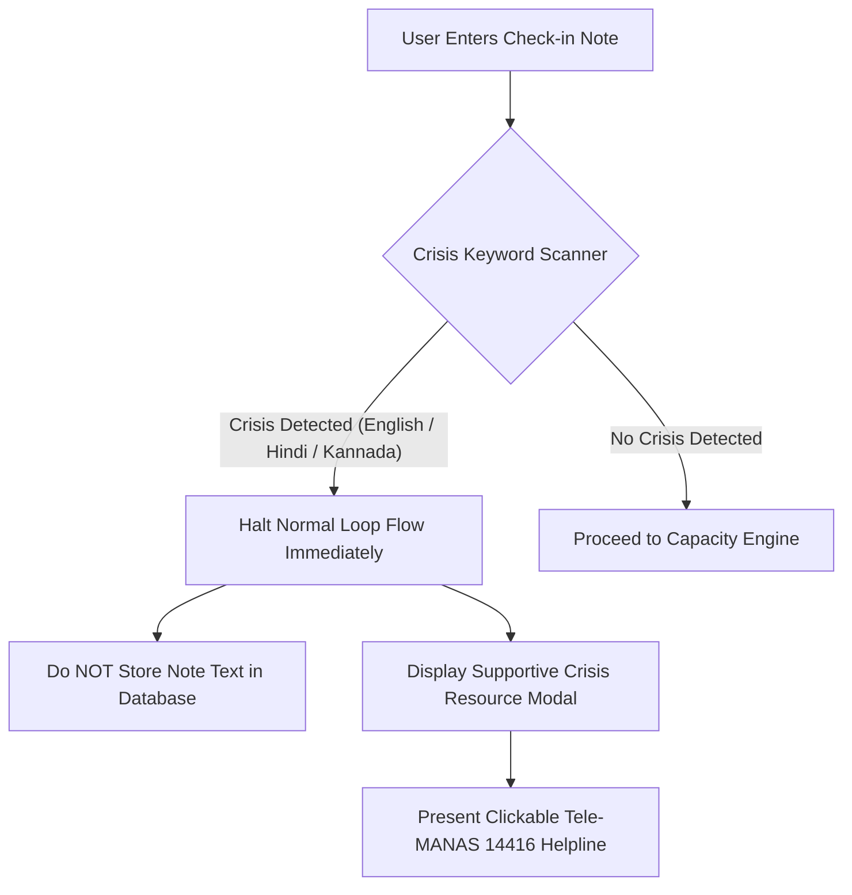

# MaxxLoop Privacy & Safety Policy

*MaxxLoop is a student wellness and cognitive capacity companion, not a medical device or healthcare provider.*

---

## 1. Non-Medical Product Disclaimer

MaxxLoop does **not** provide medical diagnoses, treatment plans, clinical advice, or pharmacotherapy recommendations.

- **No Medical Claims**: The app never diagnoses conditions such as Clinical Depression, ADHD, GAD, Insomnia, or Bipolar Disorder.
- **No Nutritional / Supplement Advice**: The app strictly prohibits recommending medications, nootropics, dietary supplements, or prolonged fasting.
- **Curated Low-Risk Actions**: All 24 micro-actions in the library are non-pharmacological, low-risk behaviors (diaphragmatic breathing, hydration, eye releases, posture correction, daylight exposure, hallway walking).

---

## 2. Crisis Detection & Immediate De-escalation Protocol

Students experiencing acute psychological distress must receive immediate human care rather than algorithmic micro-actions.

### Supported Crisis Vocabularies
- **English**: Self-harm, suicide, kill myself, end my life, hopeless, can't go on, better off dead.
- **Hindi (Transliterated)**: Mar jaana, khudkushi, jeene ka man nahi, marne ka man.
- **Kannada (Transliterated)**: Saayabeku, jeevana saaku, aathmahatye.

### Default Emergency Helplines
- **India (National)**: **Tele-MANAS** (`14416` / `1800-891-4416`) — 24/7 free, confidential mental health helpline run by the Ministry of Health and Family Welfare.
- **Secondary (India)**: **KIRAN Helpline** (`1800-599-0019`).
- **Global**: Linked to `https://findahelpline.com/` for international campus users.

*Code Note: Helpline numbers must be re-verified against official national registers prior to regional deployment.*

---

## 3. Persistent Low Capacity Warning

If a user's capacity score remains below 30 points for more than 5 consecutive days, the engine flags a persistent low trend and gently suggests speaking with a campus counselor or trusted individual, while keeping all features fully voluntary.

---

## 4. Privacy Architecture & Telemetry Principles

MaxxLoop is engineered from the ground up on **Zero-Knowledge, Local-First** principles.

### Local SQLite Storage
All telemetry signals, capacity snapshots, interventions, and posterior parameters are stored strictly on the user's device in local SQLite tables (`maxxloop.db`). No central user profiling database exists.

### Strict Data Redaction
- **Calendar Signals**: Calendar events are converted solely to numerical totals (`meeting_minutes`, `back_to_back_count`). Raw calendar event titles, meeting locations, notes, and attendee email addresses are **never stored** and **never transmitted**.
- **Browser Signals**: Browser visibility counts tab blurs (`context_switches_per_hour`). Visited URLs, web page titles, and browser history are **never captured**.
- **Free-Text Notes**: Self-report notes are processed in memory for crisis filtering and discarded unless explicit consent is provided.

### Transparent LLM Payload Inspection
Users can inspect the exact payload sent to an LLM at any time via `/privacy`. The transmission is strictly confined to 4 sanitized variables:
1. Standardized score
2. Personal baseline
3. Top driver categories
4. Chosen micro-action title

### Right to Portability & Erasure (GDPR / DPDP Compliance)
- **Export Data**: Full export of all recorded signals, snapshots, interventions, and outcomes as a structured JSON file with one click.
- **Permanent Erasure**: Instant hard deletion of all user records from SQLite with zero residual caching.
